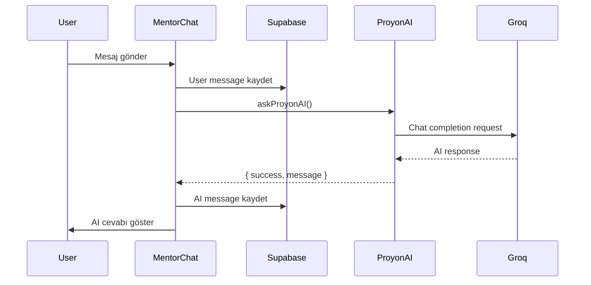

# ProYön AI - Mentor Chat Integration

## 🎉 Yenilikler

### ✅ Groq API Entegrasyonu Tamamlandı
ProYön AI artık **Groq Llama 3.3 70B** ile çalışıyor! Geçici mock sistemden gerçek AI'ya geçiş yapıldı.

---

## 📁 Oluşturulan Dosyalar

### `lib/proyonAI.ts`
**Purpose:** ProYön AI mentor chat engine  
**Key Features:**
- Groq Llama 3.3 70B integration
- Context-aware responses (project + node context)
- Chat history support (last 5 messages)
- Error handling (rate limits, token limits)
- Token optimization (max 2048 tokens response)

**Functions:**
```typescript
askProyonAI({
  userMessage: string,
  projectContext?: { title, description, domain },
  nodeContext?: { title, description, technicalRequirements, order },
  chatHistory?: Array<{ role, content }>
}): Promise<{ success, message?, error? }>
```

---

## 🔧 Güncellenen Dosyalar

### 1. `components/dashboard/mentor-chat.tsx`
**Değişiklikler:**
- ❌ Mock AI response kaldırıldı
- ✅ `askProyonAI()` fonksiyonu entegre edildi
- ✅ Proje bilgisi state eklendi
- ✅ Chat history context desteği
- ✅ Hata mesajları kullanıcıya gösteriliyor
- ✅ "ProYön AI Hazır 🚀" mesajı
- ✅ "Powered by Groq Llama 3.3 70B" badge

**Öncesi:**
```typescript
// TODO: Call AI API to get response
// For now, mock AI response
await new Promise((resolve) => setTimeout(resolve, 1500));
const aiResponse = `Bu bir geçici AI yanıtıdır...`;
```

**Sonrası:**
```typescript
const aiResponse = await askProyonAI({
  userMessage,
  projectContext: project ? { ... } : undefined,
  nodeContext: selectedNode ? { ... } : undefined,
  chatHistory: messages.slice(-5).map(...)
});
```

### 2. `components/dashboard/project-dashboard.tsx`
**Değişiklikler:**
- "AI Mentor" → "ProYön AI"
- Icon color: `text-cyan-400` → `text-violet-400`

### 3. `components/dashboard/generate-roadmap-cta.tsx`
**Değişiklikler:**
- "AI Mentor" → "ProYön AI"

### 4. `components/dashboard/mentor-chat-demo.tsx`
**Değişiklikler:**
- "Proyon AI Mentor'üm" → "ProYön AI"

### 5. `README.md`
**Değişiklikler:**
- "AI Mentor" → "ProYön AI"
- "Google Gemini AI" → "Groq Llama 3.3 70B"

---

## 🤖 ProYön AI Özellikleri

### 1. **Bağlam Farkındalığı (Context-Aware)**
ProYön AI her sohbette şunları biliyor:
- **Proje bilgisi:** Başlık, açıklama, alan (software/hardware/construction/research)
- **Aktif adım:** Kullanıcı hangi adımda takıldı
- **Teknik detaylar:** O adımın teknik gereksinimleri
- **Sohbet geçmişi:** Son 5 mesaj (user + assistant)

### 2. **Akıllı Prompt Sistemi**
```
Sen **ProYön AI**, Türkiye'nin en gelişmiş proje mentoru yapay zekasısın.

YAKLAŞIMIN:
1. Empati Kur
2. Bağlam Analizi
3. Net Çözümler (adım adım)
4. Teknik Detay (kod örnekleri, malzeme listesi)
5. Motivasyon

CEVAP FORMATI:
1️⃣ Anlıyorum
2️⃣ Çözüm (Adım 1, 2, 3...)
3️⃣ Teknik Detaylar
4️⃣ Ek Kaynaklar
5️⃣ Motivasyon
```

### 3. **Alan Spesifik Öneriler**
- **Yazılım:** Kod örnekleri, framework/library önerileri, debugging
- **Donanım:** Devre şeması, elektronik parça listesi, bağlantı diyagramı
- **İnşaat:** Malzeme listesi, yapım teknikleri, güvenlik uyarıları
- **Araştırma:** Metodoloji, veri analizi, bilimsel kaynaklar

### 4. **Hata Yönetimi**
```typescript
// Rate limit (429)
"ProYön AI şu anda çok meşgul. Lütfen 1-2 dakika sonra tekrar deneyin."

// Token limit (413)
"Mesajınız çok uzun. Lütfen daha kısa bir soru sorun."

// Generic error
"ProYön AI ile bağlantı kurulamadı. Lütfen tekrar deneyin."
```

---

## 🔥 Token Optimizasyonu

### Input Token Budget
| Bileşen | Karakter | Token | Not |
|---------|----------|-------|-----|
| System Prompt | ~3,500 | ~2,800 | Sabit |
| Project Context | ~500 | ~400 | Opsiyonel |
| Node Context | ~300 | ~240 | Opsiyonel |
| User Message | ~500 | ~400 | Kullanıcı sorusu |
| Chat History (5 msg) | ~1,000 | ~800 | Opsiyonel |
| **TOPLAM INPUT** | ~5,800 | **~4,640** | ✅ Safe |

### Output Token Budget
- **max_tokens:** 2048
- **Ortalama kullanım:** 1,000-1,500 token
- **Toplam (input + output):** ~6,000 token (limit: 12,000) ✅

---

## 📊 Kullanım Akışı



---

## 🧪 Test Senaryoları

### ✅ Test 1: Basit Soru
**Input:**
```
User: "React useState nasıl kullanılır?"
Project: E-ticaret web sitesi (Software)
Node: null
```

**Expected Output:**
```
1️⃣ Anlıyorum
React'te state yönetimi öğrenmek istiyorsun...

2️⃣ Çözüm
- Adım 1: useState'i import et
- Adım 2: Component'te tanımla
- Adım 3: State'i güncelle

3️⃣ Teknik Detaylar
```typescript
import { useState } from 'react';

function Counter() {
  const [count, setCount] = useState(0);
  ...
}
```
...
```

### ✅ Test 2: Adım Spesifik Yardım
**Input:**
```
User: "Adım 3 - Veritabanı Şeması Tasarımı kısmında takıldım"
Project: Blog platformu (Software)
Node: { title: "Veritabanı Şeması", technical_requirements: "PostgreSQL, Prisma" }
```

**Expected Output:**
```
1️⃣ Anlıyorum
Veritabanı şeması tasarlarken yardıma ihtiyacın var...

2️⃣ Çözüm
Blog platformu için şu tabloları oluştur:
- **users**: Kullanıcı bilgileri
- **posts**: Blog yazıları
- **comments**: Yorumlar
- **tags**: Etiketler

3️⃣ Teknik Detaylar (Prisma Schema)
```prisma
model User {
  id    String @id @default(uuid())
  email String @unique
  posts Post[]
}

model Post {
  id      String @id @default(uuid())
  title   String
  content String
  userId  String
  user    User   @relation(fields: [userId], references: [id])
}
```
...
```

### ✅ Test 3: Donanım Projesi
**Input:**
```
User: "Arduino ile sıcaklık sensörü nasıl bağlanır?"
Project: Akıllı ev sistemi (Hardware)
Node: { title: "Sensör Entegrasyonu", technical_requirements: "DHT22, Arduino Nano" }
```

**Expected Output:**
```
1️⃣ Anlıyorum
DHT22 sıcaklık sensörünü Arduino Nano'ya bağlamak istiyorsun...

2️⃣ Çözüm
- Adım 1: DHT22'nin pinlerini tanı (VCC, GND, DATA)
- Adım 2: Arduino'ya bağla (5V, GND, Digital Pin 2)
- Adım 3: DHT kütüphanesini yükle
- Adım 4: Kodu yaz

3️⃣ Teknik Detaylar
**Bağlantı Şeması:**
DHT22 VCC  → Arduino 5V
DHT22 GND  → Arduino GND
DHT22 DATA → Arduino D2
DHT22 DATA - 10kΩ pullup resistor → 5V

**Arduino Kodu:**
```cpp
#include <DHT.h>
#define DHTPIN 2
#define DHTTYPE DHT22

DHT dht(DHTPIN, DHTTYPE);

void setup() {
  Serial.begin(9600);
  dht.begin();
}

void loop() {
  float temp = dht.readTemperature();
  Serial.print("Sıcaklık: ");
  Serial.println(temp);
  delay(2000);
}
```
...
```

---

## 🚀 Sonraki Adımlar

### 🎯 Tamamlandı ✅
- [x] Groq API entegrasyonu
- [x] Context-aware responses
- [x] Chat history support
- [x] Error handling
- [x] Token optimization
- [x] UI güncellemeleri ("ProYön AI" branding)

### 🔮 Gelecek İyileştirmeler
- [ ] **Görsel Analiz:** Fotoğraf/diyagram yükleme (multimodal AI)
- [ ] **Kod Suggestion:** Inline kod önerileri
- [ ] **Voice Input:** Sesli soru sorma
- [ ] **Export Chat:** Sohbet geçmişini PDF olarak indirme
- [ ] **Favoriler:** Yararlı AI cevaplarını kaydetme
- [ ] **Feedback System:** AI cevaplarına 👍/👎

---

## 📝 API Key Güvenliği

**Şu anki durum:**
```env
NEXT_PUBLIC_GROQ_API_KEY=gsk_FwBM...
```

⚠️ **NEXT_PUBLIC_** prefix'i browser'da key'i açığa çıkarır!

**Gelecek düzeltme:**
1. Server-only key kullan (NEXT_PUBLIC_ kaldır)
2. API Route oluştur (`/api/chat`)
3. Client → API Route → Groq

```typescript
// app/api/chat/route.ts
export async function POST(req: Request) {
  const apiKey = process.env.GROQ_API_KEY; // Server-only
  // ...
}
```

---

**Son Güncelleme:** 19 Aralık 2025  
**Durum:** ✅ ProYön AI Aktif  
**Model:** Groq Llama 3.3 70B Versatile  
**Token Limit:** 12,000/request (free tier)
